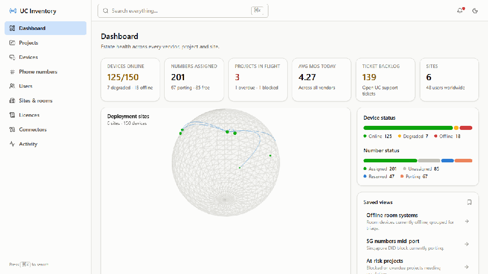

<div align="center">

# Fleetline

**A management console for unified-communications deployments** — track projects, the
devices deployed under them (Poly · Cisco Webex · Microsoft Teams Rooms), and the
phone numbers assigned across them, with connector health, analytics and an audit log.

[](https://uc-inventory-lcm-and-pm.onrender.com/)




<sub>⏳ The live demo is on a free host — the first request may take ~30s to wake the server.</sub>

</div>

## Stack

- **Backend** — Express 4 + TypeScript (strict). In-memory store rebuilt
  deterministically from a seeded generator on boot; vendor providers behind a
  single interface.
- **Frontend** — Vite 5 + React 18 + TypeScript (strict) + Tailwind (token-based
  design system, light + dark). Recharts for 2D charts; React Three Fiber for
  the single 3D dashboard hero (lazy-loaded).
- **Tests** — Vitest: provider-mapping unit tests + API tests (backend),
  route-render smoke tests (frontend).

## Getting started

```bash
# Backend (port 4000)
cd backend
npm install
npm run dev

# Frontend (port 5173, proxies /api to :4000)
cd frontend
npm install
npm run dev
```

Open http://localhost:5173. No credentials are needed in the default mock mode —
every screen is populated from seeded data.

### Scripts

| Where | Command | What |
|---|---|---|
| backend | `npm run dev` / `build` / `start` / `test` | ts-node dev / tsc / run dist / vitest |
| frontend | `npm run dev` / `build` / `test` / `lint` | vite dev / tsc + vite build / vitest / eslint |

## Mock vs live data

The backend reads `DATA_SOURCE` from the environment (see
[backend/.env.example](backend/.env.example)):

- `DATA_SOURCE=mock` *(default)* — deterministic seeded dataset: 8 projects,
  150 devices, 400 E.164 numbers across 6 countries, 48 users, 6 sites, 38
  rooms, licences, 90 days of call-quality/uptime/ticket series, activity log,
  notifications and saved views. Edge cases are seeded on purpose: one project
  blocked **and** overdue, devices offline/degraded, a Singapore number block
  mid-port, and the Webex connector in a 401 error state (to exercise the
  degradation paths).
- `DATA_SOURCE=live` — real vendor APIs using the credentials below. A vendor
  with missing credentials shows as **Disabled** on the Connectors page; a
  failing vendor shows as **Error** while reads keep serving the last synced
  data. Live sync never blanks a page.

## Sign-in (optional)

The app runs in **guest mode** by default — fully usable with no login. When OAuth
credentials are configured, a **Sign in** button appears offering **Google** and
**Microsoft** (only the providers you've configured show up). Sessions are stateless
signed cookies (no database). On each sign-in the owner gets an **email alert**
(via Resend) with the visitor's name, email, provider, time and IP.

Configure it with the `APP_BASE_URL`, `SESSION_SECRET`, `GOOGLE_*` / `MICROSOFT_*`,
and `RESEND_API_KEY` / `ALERT_EMAIL_TO` env vars — see
[backend/.env.example](backend/.env.example). Redirect URIs to register:
`{APP_BASE_URL}/api/auth/google/callback` and `.../api/auth/microsoft/callback`.

## Connector architecture

One interface, `UcProvider`
([backend/src/providers/types.ts](backend/src/providers/types.ts)):
`listDevices · getDevice · listRooms · listUsers · listPhoneNumbers ·
getDeviceHealth · getCallQuality · syncStatus` — four implementations. All
vendor payloads are normalized at the provider boundary into one internal
model; the UI never branches on vendor.

| Provider | Auth | Endpoints |
|---|---|---|
| **MicrosoftTeamsProvider** | OAuth2 client credentials (`login.microsoftonline.com`) | Graph `teamwork/devices`, `places`, `users`, `callRecords/getPstnCalls`; `@odata.nextLink` paging |
| **WebexProvider** | Bearer token | `webexapis.com/v1` `devices`, `workspaces`, `people`, `telephony/config/numbers`; Link-header paging |
| **PolyProvider** | Lens client-credentials token (`login.lens.poly.com`) | Lens GraphQL `deviceSearch`, `roomSearch`; page-count paging |
| **MockProvider** | — | Seeded store through the identical interface |

Shared HTTP layer: request timeout, retry with exponential backoff on 429/5xx
honoring `Retry-After`.

**Env vars per vendor** (backend only; never sent to the browser):

```
# Microsoft Teams — Azure AD app registration with application permissions:
#   TeamworkDevice.Read.All, User.Read.All, Place.Read.All, CallRecords.Read.All
MS_TENANT_ID=  MS_CLIENT_ID=  MS_CLIENT_SECRET=

# Cisco Webex — admin/service-app token with scopes:
#   spark-admin:devices_read, workspaces_read, people_read, telephony_config_read
WEBEX_ACCESS_TOKEN=

# Poly Lens — API connection (Account > API Connections)
POLY_LENS_CLIENT_ID=  POLY_LENS_API_SECRET=
```

Known live-mode limits (documented in code, not faked): Graph and Webex expose
per-day call *volume* over public REST but not per-day MOS/jitter aggregates
(CQD / Control Hub only), and Poly Lens has no number inventory or public
call-quality feed.

## Frontend notes

- **Design tokens** in [frontend/src/index.css](frontend/src/index.css) — full
  light + dark palettes (CVD-validated categorical series, reserved status
  colors), radii, elevation. Components consume tokens only.
- **⌘K / Ctrl-K** opens the command palette (navigation + live global search).
- Tables: sort, column visibility, bulk select + CSV export, pagination,
  sticky headers, row detail drawers; they degrade to card lists below `md`.
  Filters live in the URL, so saved views deep-link.
- Every async surface has skeleton / empty / error states; empty states are
  reachable by filtering, not by default.
- The 3D globe is the only 3D element: lazy-loaded after browser idle,
  instanced markers, no per-frame allocation, DPR capped at 1.5, and a static
  frame under `prefers-reduced-motion`.

## Numbers (production build)

Bundle (gzip): app shell 23 kB + per-route chunks 0.3–3.4 kB; recharts 158 kB
and three.js 225 kB in split chunks loaded only where used (dashboard).

Lighthouse (headless Chrome): **desktop** 99 perf / 100 a11y / 100 best
practices (FCP 0.7 s, TBT 50 ms); **mobile (throttled)** 48 perf on the
chart-heavy dashboard, 79 on table routes (TBT 40 ms) — the mobile score is
FCP-bound under simulated slow 4G.
